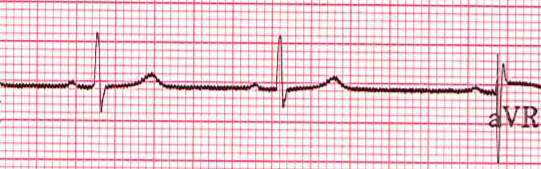
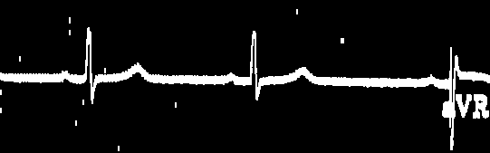

# ECG-Paper-Record-Digitization-and-Analysis (Ongoing)
Conversion of Electrocardiography paper records to digitized form. Application of binarization techniques using OpenCV have been used to remove the background noise in the images and connected broken lines of the ECG cruve by using morphological transformations to extract features to feed in the machine learning model.

